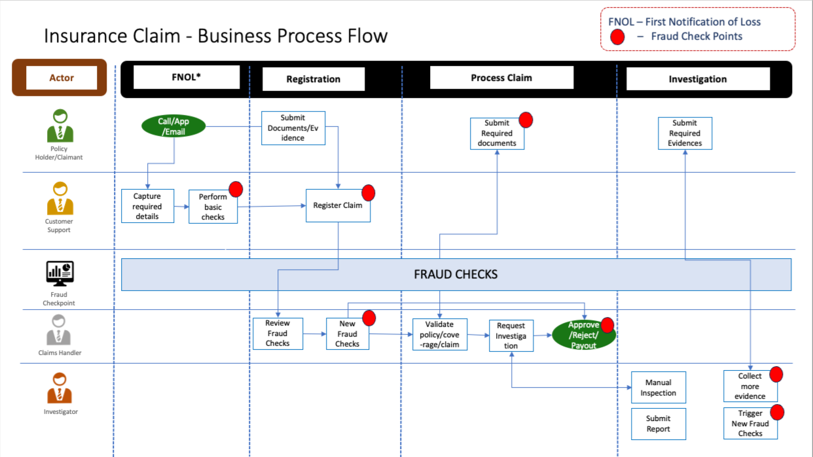

# ClaimSense 🛡️

> **An AI-powered platform for intelligent insurance claim analysis, fraud detection, and risk mitigation.**

---

## 🔭 Vision

> *"To give insurers an intelligent fraud detection platform that continuously adapts to ever-changing fraud schemes — settling genuine claims faster, protecting capital and building the trust of stakeholders."*

---

<!-- ## 💡 Founder's Vision

Insurance fraud is not just a financial problem — it's a trust problem.

Every year, billions are lost to fraudulent claims, driving up premiums for honest policyholders and putting immense pressure on claims adjusters to make the right call — fast. Yet the tools available to them have struggled to keep up with fraudsters who constantly change their tactics.

Claims adjusters are caught in an impossible position. They are expected to process claims quickly, treat customers fairly, and spot fraud accurately — all at the same time, often relying on gut instinct and outdated rules.

**We believe it doesn't have to be this way.**

Our vision is simple — give every insurer and claims team the ability to fight fraud from day one, without lengthy setups, complex integrations, or specialist data teams. Connect your data, and the system gets to work immediately — learning, adapting, and surfacing the claims that need a closer look.

Because when fraud is caught early and genuine claims are settled faster, everyone wins:
- 🏢 Insurers protect their bottom line
- 🔍 Claims adjusters get their confidence back
- 🤝 Honest policyholders get the fair, fast service they deserve

> *Fraud will keep evolving. So will we.* -->

---

## 🎯 Scope

### Insurance Line
ClaimSense is purpose-built for **insurance products** -  the scope of the pilot version is to cover the Auto insurance:

| Coverage | Description |
|---|---|
| **Liability** | Claims arising from damage or injury caused to a third party — including bodily injury and property damage liability |
| **Collision** | Coverage that applies even when multiple parties act together in causing a loss, as long as the event itself (e.g., accident, liability) is a covered peril and no exclusions apply|
| **Comprehensive** | Claims for non-collision damage to the insured vehicle — including theft, fire, weather events, and vandalism |

### What ClaimSense Does
- Connects directly to your existing claims data — no migration required
- Runs predictive fraud scoring across all open and closed claims
- Applies a combination of standard out-of-the-box rules and custom insurer-defined rules
- Allows claims teams to deep-dive individual claims, test new rules, and save them for future use
- Delivers fraud scores with full explainability so adjusters understand exactly why a claim was flagged

### ClaimSense Future Product Roadmap
- Personal lines other products
- - Commercial lines
- Health insurance
- Life insurance 
---

### Insurance Claims Process Overiew and possible Fraud check points


## Personal Auto Claims — Fraud Checks by Process Stage


| **Stage** | **Fraud Rules (Plain Language)** | **Example Scenario** | **Fraud Type** |
|---|---|---|---|
| **① FNOL** *(First Notice of Loss)* | • Does the claimant match the policyholder on record? <br>• Was the claim reported unusually late after the incident? <br>• Has this person or vehicle been involved in previous claims? <br>• Are any other parties linked to the claimant (family, associates)? | A "hit-and-run" claim is filed, but the other vehicle turns out to belong to a relative — and the same damage was already claimed 8 months ago without any repair being done | Collusive Fabrication · Duplicate Claim |
| **② Registration & Triage** | • Was the policy actually active on the date of the incident? <br>• Do the photos and documents look genuine, or have they been digitally altered? <br>• Do official weather records actually support the claimed weather damage? <br>• Could the damage photos have been AI-generated or reused from elsewhere? | A customer submits high-quality flood damage photos, but weather records show no rainfall that day — and the image file timestamps have been tampered with | Synthetic Evidence · False Loss Cause |
| **③ Investigation & Assessment** | • Do dashcam, CCTV, or telematics data actually match the claimant's version of events? <br>• Are the same people, clinics, or repairers appearing across multiple unrelated claims? <br>• Does the number of injured passengers match what's shown on scene footage? <br>• Has the same damage pattern appeared in a previous claim on a different vehicle? <br>• Does the claimant's social media contradict the injuries or loss they're claiming? | A rear-end collision results in 5 injury claims, but CCTV shows only 2 people in the car — and those same individuals appear in 3 other claims filed at the same clinic | Organised Staged Accident · Injury Padding |
| **④ Settlement & Payment** | • Does the claim pass an automated fraud risk score before payment is released? <br>• Is the payee flagged on any sanctions, watchlists, or known fraud databases? <br>• Is the bank account receiving payment new, recently changed, or linked to other claims? <br>• Has the same repair or treatment already been paid out by another insurer? | A repair shop submits an invoice for work already paid by the claimant's previous insurer — and the "repaired" vehicle had the same damage re-claimed 6 months later | Duplicate Claim · Double Billing |


## ✨ Key Features

- ⚡ **Instant activation** — operational the moment it connects to your data
- 🧠 **Adaptive AI** — continuously learns and evolves with emerging fraud patterns
- 🔍 **Real-time fraud detection** — flags suspicious claims early, before payouts are made
- ✅ **Faster genuine claims** — reduces processing time for legitimate claims
- 📊 **Adjuster intelligence** — empowers adjusters with explainable risk scores
- 💰 **Revenue protection** — blocks fraudulent claims before they impact the bottom line

---

<!-- ## 🚀 Getting Started

```bash
# Clone the repository
git clone https://github.com/your-org/claimsense.git

# Navigate to the project directory
cd claimsense

# Install dependencies
pip install -r requirements.txt

# Connect your data and run
python main.py
```

---

## 📄 License

This project is licensed under the MIT License — see the [LICENSE](LICENSE) file for details.

---

## 🤝 Contributing

Contributions are welcome! Please read our [Contributing Guide](CONTRIBUTING.md) to get started.

--- -->

*Built with ❤️ to make insurance fairer for everyone.*
