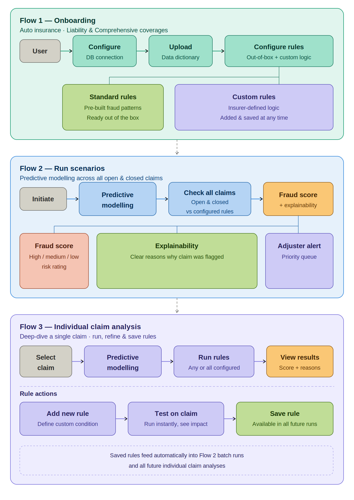

# ClaimSense 🛡️

> **An AI-powered platform for intelligent insurance claim analysis, fraud detection, and risk mitigation.**

---

## 🔭 Vision

> *"To give insurers an intelligent fraud detection platform that continuously adapts to ever-changing fraud schemes — settling genuine claims faster, protecting capital and building the trust of stakeholders."*

---

<!-- ## 💡 Founder's Vision

Insurance fraud is not just a financial problem — it's a trust problem.

Every year, billions are lost to fraudulent claims, driving up premiums for honest policyholders and putting immense pressure on claims adjusters to make the right call — fast. Yet the tools available to them have struggled to keep up with fraudsters who constantly change their tactics.

Claims adjusters are caught in an impossible position. They are expected to process claims quickly, treat customers fairly, and spot fraud accurately — all at the same time, often relying on gut instinct and outdated rules.

**We believe it doesn't have to be this way.**

Our vision is simple — give every insurer and claims team the ability to fight fraud from day one, without lengthy setups, complex integrations, or specialist data teams. Connect your data, and the system gets to work immediately — learning, adapting, and surfacing the claims that need a closer look.

Because when fraud is caught early and genuine claims are settled faster, everyone wins:
- 🏢 Insurers protect their bottom line
- 🔍 Claims adjusters get their confidence back
- 🤝 Honest policyholders get the fair, fast service they deserve

> *Fraud will keep evolving. So will we.* -->

---

## 🎯 Scope

### Insurance Line
ClaimSense is purpose-built for **Auto Insurance** to begin with, covering the two most fraud-prone claim types:

| Coverage | Description |
|---|---|
| **Liability** | Claims arising from damage or injury caused to a third party — including bodily injury and property damage liability |
| **Comprehensive** | Claims for non-collision damage to the insured vehicle — including theft, fire, weather events, and vandalism |

### What ClaimSense Does
- Connects directly to your existing claims data — no migration required
- Runs predictive fraud scoring across all open and closed claims
- Applies a combination of standard out-of-the-box rules and custom insurer-defined rules
- Allows claims teams to deep-dive individual claims, test new rules, and save them for future use
- Delivers fraud scores with full explainability so adjusters understand exactly why a claim was flagged

### What ClaimSense Does Not Cover (v1)
- Health insurance claims
- Life insurance claims
- Commercial or fleet insurance
- First Notice of Loss (FNOL) automation
- Direct policyholder-facing features

> Future releases will expand coverage to additional lines of business based on insurer demand.

---

## 🏗️ Business Architecture

The diagram below illustrates ClaimSense's three core operational flows — from initial setup through to batch fraud detection and individual claim deep-dives.



### Flow 1 — Onboarding
The user connects ClaimSense to their data environment and configures the rule set before any analysis begins:

1. **Configure DB connection** — point ClaimSense at your claims database; no data migration needed
2. **Upload data dictionary** — map your schema so ClaimSense understands your data structure
3. **Configure rules** — choose from standard out-of-the-box fraud rules and add custom insurer-defined rules

### Flow 2 — Run Scenarios
Once configured, ClaimSense runs a full batch analysis across all claims:

1. **Initiate** — trigger a scenario run manually or on a schedule
2. **Predictive modelling** — AI analyses patterns across your claims history
3. **Check all claims** — every open and closed claim is evaluated against configured rules
4. **Output** — each claim receives a fraud score (high / medium / low), a clear explainability summary, and is added to the adjuster's prioritised investigation queue

### Flow 3 — Individual Claim Analysis
For claims that need closer attention, adjusters can deep-dive a single claim:

1. **Select claim** — pick any claim from the system
2. **Predictive modelling** — run AI analysis on that specific claim
3. **Run rules** — apply any or all configured rules to the claim
4. **View results** — see the fraud score and the reasons behind it
5. **Add a new rule** — define a custom condition based on what you observe
6. **Test on claim** — instantly see the impact of the new rule on the selected claim
7. **Save rule** — the new rule is saved and automatically applied in all future Flow 2 batch runs and individual claim analyses

---

## ✨ Key Features

- ⚡ **Instant activation** — operational the moment it connects to your data
- 🧠 **Adaptive AI** — continuously learns and evolves with emerging fraud patterns
- 🔍 **Real-time fraud detection** — flags suspicious claims early, before payouts are made
- ✅ **Faster genuine claims** — reduces processing time for legitimate claims
- 📊 **Adjuster intelligence** — empowers adjusters with explainable risk scores
- 💰 **Revenue protection** — blocks fraudulent claims before they impact the bottom line

---

<!-- ## 🚀 Getting Started

```bash
# Clone the repository
git clone https://github.com/your-org/claimsense.git

# Navigate to the project directory
cd claimsense

# Install dependencies
pip install -r requirements.txt

# Connect your data and run
python main.py
```

---

## 📄 License

This project is licensed under the MIT License — see the [LICENSE](LICENSE) file for details.

---

## 🤝 Contributing

Contributions are welcome! Please read our [Contributing Guide](CONTRIBUTING.md) to get started.

--- -->

*Built with ❤️ to make insurance fairer for everyone.*
